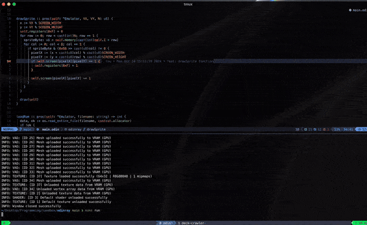

# CHIP-8 Emulator in Odin

This is a simple CHIP-8 emulator written in Odin using the Raylib library. The emulator reads CHIP-8 ROM files, interprets the instructions, and renders the output on a 64x32 pixel display (scaled by 8). For now only added the cpu instructions that runs the classic IBM logo program.

<div align="center">
  
</div>

## Features

- **Emulation of CHIP-8 instructions:** Supports basic CHIP-8 operations including memory management and drawing sprites.
- **Rendering with Raylib:** Uses Raylib for rendering the CHIP-8 display, scaled up for better visibility.
- **ROM Loading:** Load any CHIP-8 ROM file and run it in the emulator.

## Prerequisites

- **Odin Compiler**: Download the Odin compiler from [here](https://odin-lang.org/download/).

- **Raylib for Odin**: Install Raylib and ensure it is accessible in your Odin environment.

## Installation

1. Clone this repository:

   ```sh
   git clone https://github.com/kaandesu/chip8-emulator-odin.git
   cd chip8-emulator-odin
   ```

2. Compile the emulator

   ```sh
   make
   ```

3. Run the emulator:

   ```sh
   make run
   ```

4. Usage

- Place the CHIP-8 ROM file in the `./demos/` directory.

- Modify the `loadRom` function call to point to your ROM file:

  ```odin
  loadRom(emulator, "./ibm_logo.ch8")
  ```

- Run the emulator to start the CHIP-8 program.
